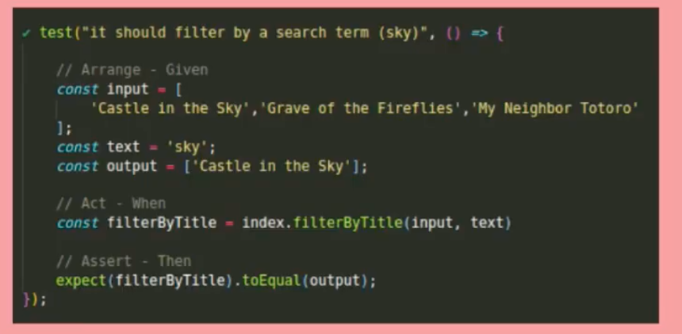

# mock-spy-node-jasmine
Esto es un ejemplo sencillo de uso de mocks, spies, stubs, fakes...

## Instalar y ejecutar los test
Descarga el repositorio e instala las dependencias: `npm install`.  

Para ejecutar los tests, usa el comando: `npm test`.

------

## Introducción teórica de conceptos

### Mocks: 
Un mock es un "doble de prueba" (test double) que sustituye por completo el método/función/objeto original.

### Spy:
Afectan a un objeto, clase o función, pero no alteran el original, sino que se limitan a observar cosas, como el número de veces que se pasa por un método o la cantidad de argumentos que recibe.

### Stub:
Se comportan como los spies, pero además reemplazan alguna funcionalidad original, como el resultado que se devuelve después de un proceso

> Este tipo de artilugios -los spies, stubs, fakes, mocks y demás- reciben el nombre de dobles, porque al igual que los dobles de las películas reemplazan al actor principal.

-------

## Given When Then // Arrange Act Assert

-------

## Utilidades: 
* https://www.npmjs.com/package/rewire
* https://www.npmjs.com/package/mockery